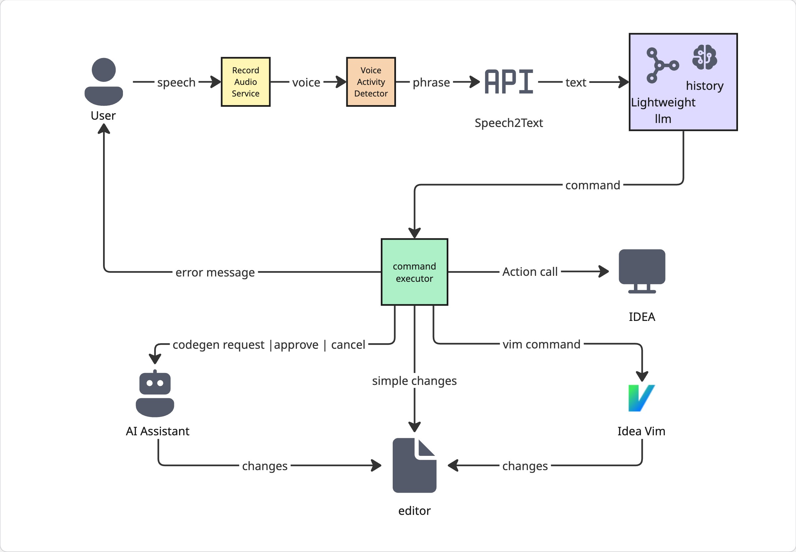

# ide-voice-assistant

<!-- Plugin description -->
IDE Voice Agent lets you control IntelliJ IDEA using natural language.  
Say what you want to do — the agent understands your intent and executes it by calling IntelliJ actions or Vim under the hood. Hands‑free, ~~fast, and safe~~.
<!-- Plugin description end -->

## Overview

IDE Voice Agent brings hands‑free productivity to IntelliJ IDEA. You speak naturally (“open the main file”, “insert a TODO and format”, “generate tests for this class”), and the agent:
- detects your speech,
- converts audio to text,
- understands intent,
- executes the exact IDE operation.

You never have to remember specific action IDs — just describe the goal in everyday language, and the agent does the rest.

### What you can say (examples)
- “Open FileNavigator.kt”
- “Create file src/test/kotlin/ExampleTest.kt”
- “Insert TODO and move to the end of the line”
- “Generate unit tests for this class”
- “Apply formatting”
- “Cancel the last change” / “Approve changes” / “Stop”

### Key features
- Natural‑language control (multilanguage): say what you want
- Code generation from short prompts
- Navigation and file operations (open, create)
- Text editing and insertion at the caret
- Command lifecycle: approve, cancel, stop
- Intent → execution:
    - Maps your request to the most suitable IDE action
    - Or runs a Vim command when that’s the best tool for the job
- Smart model routing:
    - Uses a fast model for typical requests
    - Escalates to a heavier model when the request is ambiguous or complex
- Robust voice activity detection (VAD):
    - Local [Silero VAD](https://github.com/snakers4/silero-vad) model for voice detection
    - Spend tokens only on real requests
    - Filters out short/noisy segments to reduce false triggers

### Technical overview
- Audio + VAD: real‑time microphone capture; smart voice activity detection with filtering and probability inertia
- Speech‑to‑Text: converts audio to text while preserving developer terms and symbols
- Intent routing (function calling): maps each utterance to one command calling; falls back to “idontknow” safely when uncertain
- Execution:
    - Invokes IntelliJ actions
    - Executes Vim commands when appropriate
    - Confirmation/rollback where applicable
- Modular design: pluggable VAD; swappable STT/LLM providers; clear separation of routing and execution

## Supported commands

- Text & editing
    - Insert text at the cursor
    - Generate code from a natural‑language prompt
    - Cancel / Approve / Stop current operation
- Navigation & files
    - Open file by name (with optional package prefix)
    - Create file by path (e.g., src/main/kotlin/Foo.kt)
    - Navigate through the editor using extensive vim commands
- IDE actions
    - Natural language → specific IntelliJ action (e.g., ReformatCode)

## Installation

1. Turn on internal VPN
2. Create new LiteLLM API KEY https://litellm.labs.jb.gg/ui
3. Put it to system property: add the line `-DLITELLM_API_KEY=your-key` to
<kbd>Help</kbd> > <kbd>Edit Custom VM Options...</kbd>
4. Download the [latest release](https://github.com/flydzen/ide-voice-assistant/releases/latest)
5. Install it manually using  
<kbd>Settings/Preferences</kbd> > <kbd>Plugins</kbd> > <kbd>⚙️</kbd> > <kbd>Install plugin from disk...</kbd>
6. Enable it on the right panel

---

Plugin based on the [IntelliJ Platform Plugin Template][template].

[template]: https://github.com/JetBrains/intellij-platform-plugin-template
[docs:plugin-description]: https://plugins.jetbrains.com/docs/intellij/plugin-user-experience.html#plugin-description-and-presentation
